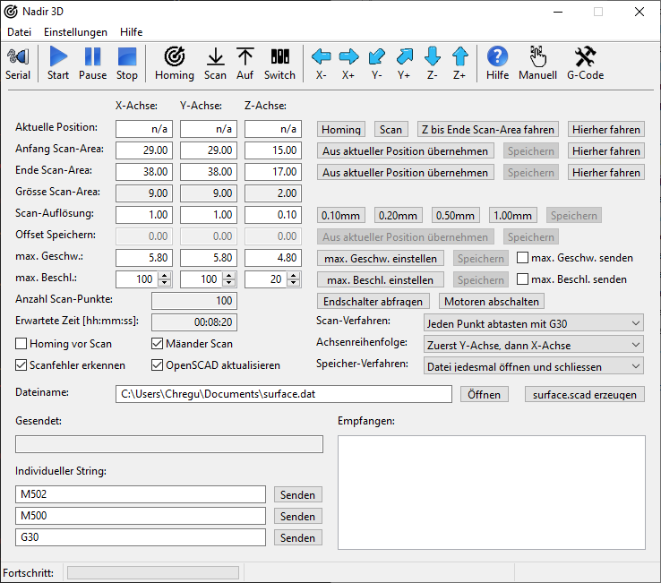
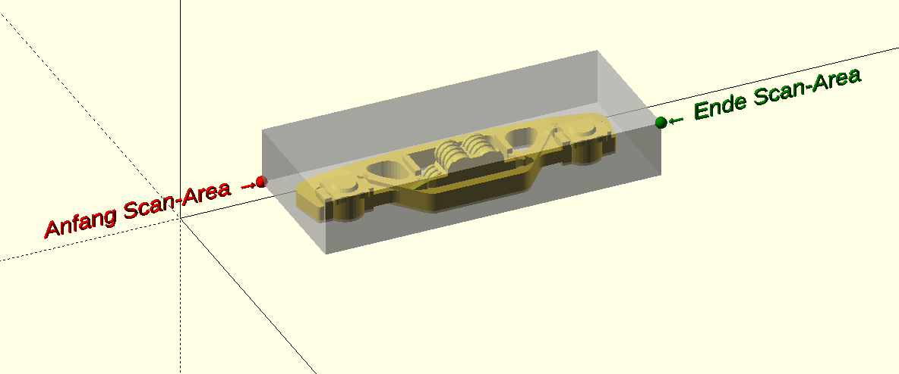
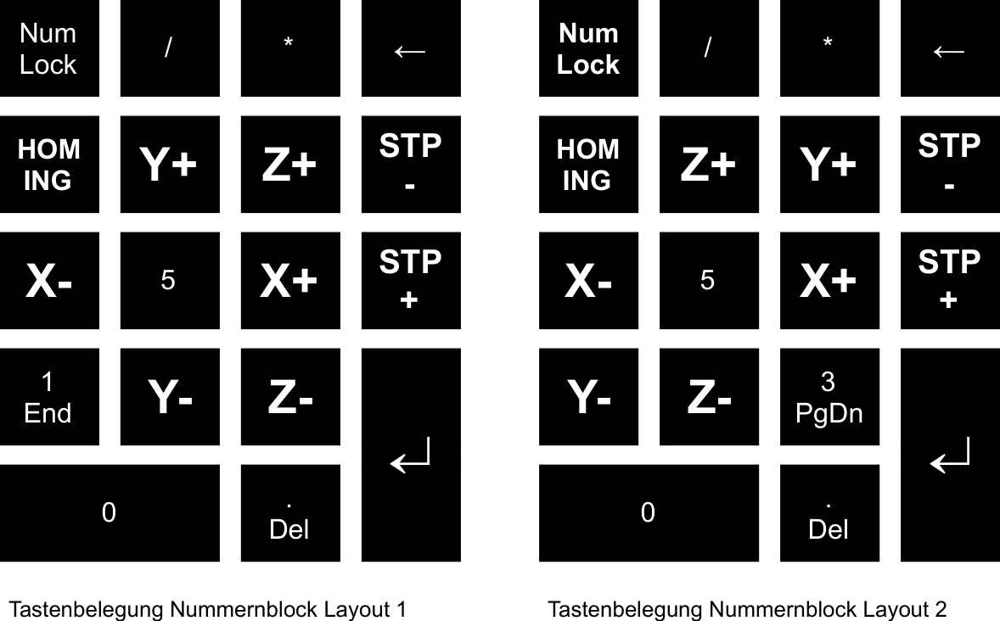

# NADIR 3D
* 3D-Scanner
* alternative Bedienung für 3D-Drucker und andere XYZ-Maschinen
* Export in OpenSCAD

## Voraussetzungen und Möglichkeiten

### Hardware-Voraussetzungen
Für die Integration in den 3D-Drucker oder CNC-Maschine müssen folgende Hardware-Komponenten vorhanden sein:

* **Mainboard-Anschluss:** Ein freier digitaler Eingang (IO-Pin). Ideal ist ein dedizierter `PROBE`-Port oder ein nicht genutzter `Z-Endstop`-Anschluss.
* **Spannungsversorgung:** Stabile 5V oder 12V-24V (je nach Ausführung des Tastkopfes).
* **Logik-Level:** Die Signalspannung des Tastkopfes muss mit der Logikspannung Ihres Controllers (meist 3.3V bei ESP32/ARM oder 5V bei AVR/Mega) kompatibel sein.

### Voraussetzung für Gerät mit G30 (Single Z-Probe)
Der Befehl `G30` führt einen einzelnen Tastvorgang an der aktuellen XY-Position aus.

1.  **Firmware-Aktivierung:** In der Firmware muss die Funktion "Z-Probe" aktiviert sein (z.B. in Marlin `#define Z_MIN_PROBE_USES_Z_MIN_ENDSTOP_PIN`).
2.  **Z-Offset Definition:** Der physikalische Abstand zwischen dem Schaltpunkt des Nadir 3D und der tatsächlichen Düsenspitze ist für Nadir 3D nicht relevant, ausser dass die Probe dann in diesem Mindestabstand vom Nullpunkt positioniert werden muss.
3.  **Tast-Geschwindigkeit:** Für eine hohe Wiederholgenauigkeit müssen die `PROBING_FEEDRATE` Werte in der Firmware moderat eingestellt sein (empfohlen: 50-100 mm/min). Die Feedrate für jede Achse kann auch in Nadir 3D eingestellt werden.

### Voraussetzung für Gerät mit M119 (Status-Abfrage)

Der Befehl `M119` wird zur Diagnose und Validierung der Signalzustände genutzt. Ausserdem arbeitet eine Scan-Methode mit diesem Befehl.

* **Pin-Mapping:** Der Tastkopf muss dem korrekten Software-Endstopp zugeordnet sein.
* **Logik-Invertierung:** Je nachdem, ob Sie den Tastkopf als Öffner (NC) oder Schließer (NO) verdrahtet haben, muss die Logik in der Software angepasst werden (`Z_MIN_PROBE_ENDSTOP_INVERTING`).
* **Pull-up Widerstand:** Um elektromagnetische Störungen (EMV) zu vermeiden, sollte der interne Pull-up-Widerstand des Mikrocontrollers für diesen Pin aktiviert sein.

### Software-Voraussetzungen

* Nadir 3D braucht nicht installiert zu werden. Es startet aus einem beliebigen Verzeichnis, auch aus Netzlaufwerken und unterstützt UNC-Pfade (Universal Naming Convention)
* Nadir 3D ist momentan für Windows x64 kompiliert. Es besteht die Möglichkeit, später auch für Windows x86, Linux (x86 - x64), OS X (x64, M1) und Raspberry (arm32, arm64) kompiliert zu werden
* Nadir 3D funktioniert ohne OpenSCAD, die Ausgabedatei ist aber an OpenSCAD angepasst
* OpenSCAD kann hier runtergeladen werden: https://openscad.org/

### Übersicht der Möglichkeiten

Mit Nadir 3D erweitern Sie Ihre Maschine um folgende Fähigkeiten:

* Abtasten einer 3D-Oberfläche
* Speichern der Punkte für den Import in OpenSCAD
* Live-Visualisierung in OpenSCAD
* Umfangreiche Übersicht aller G-Codes mit Suchfunktion
* Senden der G-Codes mit Parameter

> **Sicherheitshinweis:** Keine Software arbeitet fehlerfrei. Dies gilt auch für Nadir 3D! Für Schäden übernehme ich keine Verantwortung!

## Vorbereitung & Verbindung

Bevor ein Scan gestartet werden kann, muss die Kommunikation zur Hardware hergestellt werden:

* Öffnen Sie `Einstellungen` -> `serielle Schnittstelle...` und wählen Sie den korrekten COM-Port aus.
* Klicken Sie auf `Homing`. Die Maschine fährt alle Achsen an die Referenzschalter.  

> **Wichtig:** Ohne Homing ist keine präzise Positionierung möglich!

Sie müssen der Software mitteilen, wo das Objekt liegt. Dies geschieht über zwei Eckpunkte:

**Anfang Scan-Area**

* Fahren Sie den Kopf zur vorderen, linken, unteren Ecke des Objekts. Klicken Sie bei `Anfang Scan-Area` auf `Aus aktueller Position übernehmen`

**Ende Scan-Area**

* Fahren Sie zur hinteren, rechten, oberen Ecke. Klicken Sie bei `Anfang Scan-Area` auf `Aus aktueller Position übernehmen`

**Hierher fahren**

* Nutzen Sie die Buttons `Hierher fahren` neben den Koordinaten, um die gespeicherten Eckpunkte zur Kontrolle automatisch anzufahren.

> **Wichtig:** Die Koordinaten von `Anfang Scan-Area` müssen immer kleiner sein als von `Ende Scan-Area`!

* Wählen Sie bei `Dateiname` mit `Öffnen` eine Datei aus oder geben Sie einen Namen ein um eine neue Datei zu erstellen.

## Scan-Parameter einstellen

Die Detailgenauigkeit und Dauer des Scans werden hier gesteuert:

* Wählen Sie per Button die `Scan-Auflösung` (0.10mm bis 1.00mm) oder tragen Sie die Werte manuell in das Gadget ein. Die `Anzahl Scan-Punkte` und die `Erwartete Zeit` aktualisieren sich automatisch beim verlassen des Gadgets (verliert Fokus).
* Aktivieren Sie `Mäander Scan`, damit der Scanner im Zick-Zack fährt (spart etwas Zeit).
* `Homing vor Scan` ist empfohlen, um sicherzustellen, dass die Maschine vor einem langen Lauf perfekt kalibriert ist.
* `Achsenreihenfolge` bestimmt, ob die Maschine erst Zeilen oder erst Spalten abarbeitet.
* `Speicher-Verfahren` bestimmt, ob die Datei während des ganzen Scans geöffnet bleibt, nach jeder Zeile ein Flush ausgeführt wird oder jedesmal geöffnet und geschlossen wird.
* `Scan-Verfahren` bestimmt, wie das Objekt gescannt wird

> **Hinweis:** Die Scan-Auflösung der Z-Achse ist lediglich beim Scan-Verfahren mit M119 relevant!

## Live-Visualisierung in OpenSCAD

Um das Ergebnis während des Scans in 3D zu sehen, folgen Sie exakt diesem Ablauf:

**Schritt 1:** Klicken Sie im Scanner-Programm auf surface.scad erzeugen.  
**Schritt 2:** Starten Sie das Programm `OpenSCAD` manuell auf Ihrem Rechner.  
**Schritt 3:** Öffnen Sie in OpenSCAD die Datei `surface.scad` aus Ihrem Projektverzeichnis.  
**Schritt 4:** Aktivieren Sie in OpenSCAD im Menü `Design` die Option `Automatic Reload and Preview`.  
**Schritt 5:** Aktivieren Sie im Scanner die Checkbox `OpenSCAD aktualisieren`.

Sobald der Scan läuft, sendet das Programm nach jeder Zeile ein Signal (Aenderung in der Datei). OpenSCAD bemerkt dies und baut das 3D-Modell in Echtzeit vor Ihren Augen auf.

> **Hinweis:** Damit die Aktualisierung funktioniert, stellen Sie bitte das `Speicher-Verfahren` auf `Datei jedesmal öffnen und schliessen`

## Scannen

* Um einen automatischen Scan zu starten, drücken Sie auf `Start`
* Zum Pausieren drücken Sie auf `Pause`
* Um den Scan vorzeitig zu Beenden, drücken Sie auf `Stop`. Dies geht auch während dem Pausieren!

## Experten-Funktionen & Sicherheit

Zusätzliche Kontrollen für die Hardware:

* `Scan` führt eine einzelne Testmessung durch.
* `Z bis Ende Scan-Area fahren` oder `Auf` hebt den Sensor sicher über das Objekt an (Z-Wert aus `Ende Scan-Area`).
* `Endschalter abfragen` oder `Switch` prüft, ob die Maschine einen Anschlag berührt oder ein Fehler vorliegt.
* `Motoren abschalten` schaltet den Strom der Motoren ab (z.B. zum Abkühlen oder manuellem Verschieben).
* `max. Geschw. einstellen` bzw. `max. Beschl. einstellen` überträgt die eingetragenen Werte an die Motorsteuerung.
* Unter `Hilfe` / `G-Codes` erhalten Sie Informationen zu einigen wichtigen G-Codes
* Der Button `G-Code` öffnet eine mächtige Liste aller relevanten G-Codes. Diese können mit der Suchfunktion bequem ausgewählt werden, und - mit Parameter - gesendet werden!
* Der Button `Manuell` öffnet ein Fenster zum Verfahren der drei Achsen
* Bei `Einstellungen` / `Layout Nummernblock` kann zwischen folgenden Shortcuts gewählt werden:

* Im unteren Bereich finden Sie das **Terminal**. Hier können Sie unter `Individueller String` eigene G-Code Befehle eingeben und mit Senden direkt an die Maschine schicken. Das Feld **Empfangen** zeigt die Antwort der Hardware an.

## Beenden

Beim Beenden werden alle Einstellungen gespeichert, die serielle Schnittstelle und evtl. geöffnete Dateien geschlossen.

## AutoResponser

Der AutoResponser simuliert einen MKS TinyBee und antwortet auf die GCodes G40 und M119 detailiert und auf alle Anderen mit "ok".
In der .bat Datei kann die serielle Schnittstelle als Argument mitgegeben werden.
Die Verbindung zu Nadir 3D erfolgt über einen Null-Modem Emulator wie [com0com](https://sourceforge.net/projects/com0com/).

Nadir 3D Scanner Handbuch • 2026
